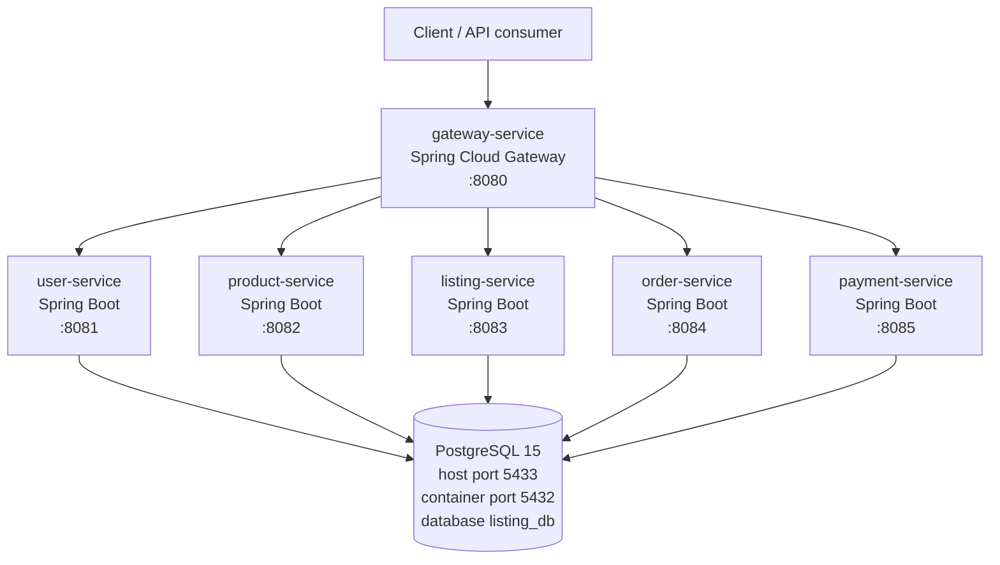

# 01 - Architecture

> Confirmed from current repository source. Last updated: 2026-06-16.

## System Overview

PropTech is currently a Spring Boot microservices monorepo. Each backend service is an independent Maven project under `server/services/` and can be built into its own Docker image.



## Runtime Topology

Docker Compose defines one PostgreSQL container plus six backend service containers.

| Service | Container | Port | Database Schema |
|---|---|---:|---|
| PostgreSQL | `proptech-postgres` | `5433:5432` | database `listing_db` |
| Gateway Service | `gateway-service` | `8080:8080` | none |
| User Service | `user-service` | `8081:8081` | `user_service` |
| Product Service | `product-service` | `8082:8082` | `product_service` |
| Listing Service | `listing-service` | `8083:8083` | `listing_service` |
| Order Service | `order-service` | `8084:8084` | `order_service` |
| Payment Service | `payment-service` | `8085:8085` | `payment_service` |

`server/infrastructure/postgres/init-db.sql` creates schemas for all five backend services. Docker Compose also waits for PostgreSQL to become healthy before starting service containers.

## Service Boundaries

| Service | Owns Today | Current API Status |
|---|---|---|
| `gateway-service` | API routing edge | Routes `/api/*` paths to backend services |
| `user-service` | Users | No REST controller confirmed |
| `product-service` | Products | No REST controller confirmed |
| `listing-service` | Real-estate listings | `GET /api/listings`, `POST /api/listings` |
| `order-service` | Orders referencing user/product IDs | No REST controller confirmed |
| `payment-service` | Payments referencing order IDs | No REST controller confirmed |

## Architecture Pattern

The intended architecture is microservices with Clean Architecture / DDD-style packages:

```text
presentation -> application -> domain
                    |
                    v
              infrastructure
```

Current implementation is still a scaffold:

- Entities are JPA entities placed under `domain/entity`.
- Spring Data repositories are under `infrastructure/repository`.
- `gateway-service` routes frontend API traffic to service containers and has no database.
- `listing-service` has a basic application service and REST controller.
- Other services currently expose repositories/entities only.
- DTOs, mappers, richer application use cases, domain events, and API exception handling are not yet consistently implemented.

## Data Ownership

All services connect to the same PostgreSQL database (`listing_db`) but use separate schemas for most services. Application code should treat each schema as owned by its service and should not directly query another service's tables.

Order and payment currently store cross-service references as UUID fields (`userId`, `productId`, `orderId`) rather than JPA relationships.

## Planned But Not Implemented

These appear in planning documents but are not confirmed in source code yet:

- Authentication and authorization
- RabbitMQ event-driven communication
- Redis caching
- Service discovery
- Monitoring stack
- Kubernetes manifests
- Real frontend applications
