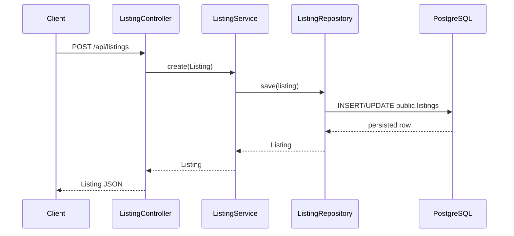
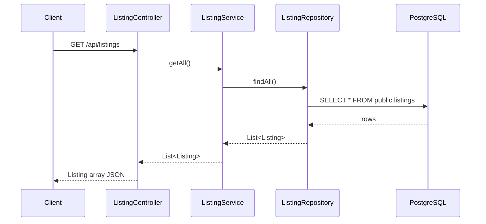

# 05 - Flows

> Current and planned flows for the Spring Boot PropTech scaffold. Last updated: 2026-06-16.

## Current Confirmed Flows

### Listing - Create

Current limitations:

- Request body is the JPA entity.
- No DTO validation.
- No authentication.
- No event publication.

### Listing - Get All

## Logical Data Flows

### Order References

`order-service` stores `userId` and `productId` as UUID values. It does not currently call `user-service` or `product-service` to validate them.

### Payment References

`payment-service` stores `orderId` as a UUID value. It does not currently call `order-service` to validate it.

## Planned Future Flows

These flows are not implemented yet and must be designed before coding:

- User registration/login/token refresh.
- Product CRUD API.
- Order creation with user/product validation.
- Payment creation with order validation.
- Listing search/filtering.
- Listing approval/rejection.
- Event publication after order/payment/listing state changes.
- Gateway-based routing for frontend clients.
